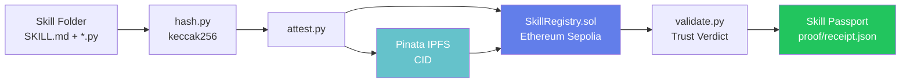
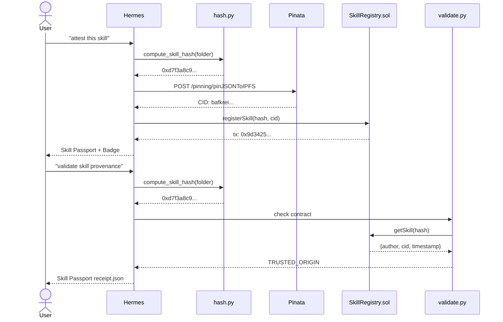

<div align="center">

# SkillProof

### On-chain Attestation & Provenance for Hermes Agent Skills

*Register once. Verify forever. No central authority.*

[](https://sepolia.etherscan.io/tx/0x9d3425ac760d5a583c3162cf1fb3a5d9d1a8f3340423b894058a04bd6587a85b)
[](https://sepolia.etherscan.io/address/0x9BaA24c3f0298423B6410C7b3a4b8Bc4B1c6919c)
[](https://gateway.pinata.cloud/ipfs/bafkreie3teph2lonn7p4ny6kf7swlxun5avt5gfob45lnmxydk5ubzq6te)
[](https://nousresearch.com)
[](LICENSE)
[](contracts/contracts/SkillRegistry.sol)
[](hermes-skill/skillproof/)

</div>

---

## Why This Exists

The Hermes Agent ecosystem has **82+ community skills** and that number keeps growing. But there is no trust layer. When you install a skill from the registry, you cannot answer the most basic question:

> *Who wrote this, and can I prove it?*

| Pain Point | Real-world Impact |
|---|---|
| No attribution | Anyone can re-publish your skill under their name |
| No integrity proof | Skills can be silently modified after publishing |
| No tamper detection | You can't know if what you're running matches the original |
| No evolution tracking | Forks have no link to their origins |
| No reward mechanism | Authors get nothing when their skills are reused |

Nous Research is building decentralized AI infrastructure. Decentralization means nothing if the skills powering your agents can be hijacked without trace.

**SkillProof solves all of this with a single cryptographic primitive: a deterministic content hash recorded on a public blockchain.**

A skill registered with hash `0xABC...` by wallet `0xDEF...` at block `N` is mathematically provable — forever, without trusting anyone.

---

## Trust Model

Every `validate` call returns exactly one of four verdicts:

### `TRUSTED_ORIGIN`
The skill's keccak256 hash was found on the SkillRegistry contract. The author wallet and timestamp are immutably recorded on Ethereum Sepolia.

```
╔════════════════════════════════════════════════════════════════╗
║              SKILL PASSPORT — TRUSTED_ORIGIN                  ║
╚════════════════════════════════════════════════════════════════╝

  IDENTITY     0xd7f3a8c9...e4f1
  AUTHOR       0xA8DBF...185d  (0xA8DBF18e67779C7B7dC839370B85940FF506185d)
  BORN         2026-05-01 14:32:00 UTC
  NETWORK      Ethereum Sepolia (chainId: 11155111)
  IPFS         bafkreie3teph2lonn7p4ny6kf7swlxun5avt5gfob45lnmxydk5ubzq6te
  TRUST        TRUSTED_ORIGIN ✓
  PARENTS      none (original work)
  CHILDREN     0 forks detected

  EVIDENCE
  ──────────────────────────────────────────────────────────────
  Contract     0x9BaA24c3f0298423B6410C7b3a4b8Bc4B1c6919c
  Transaction  0x9d3425ac760d5a583c3162cf1fb3a5d9d1a8f3340423b894058a04bd6587a85b
  Etherscan    https://sepolia.etherscan.io/tx/0x9d3425...
  IPFS         https://gateway.pinata.cloud/ipfs/bafkrei...
  Block        10773385
```

### `UNCLAIMED_ARTIFACT`
No on-chain record exists for this skill hash. This skill has never been attested. Anyone could claim authorship. Run `attest.py` to stake your claim.

### `TAMPERED_COPY`
A `proof/receipt.json` exists claiming this skill was previously attested, but the current content hash no longer matches the attested hash. The skill was modified after its original attestation. This is the most important verdict — it catches silent modifications.

### `CONFLICTING_CLAIMS` *(v0.2.0)*
Reserved for multi-author lineage disputes when skill evolution chains are implemented. Two parties claim the same hash independently.

---

## Skill Passport

Every `attest` and `validate` operation produces a machine-readable **Skill Passport** saved to `proof/receipt.json`. This is the canonical attestation record.

```json
{
  "verdict": "TRUSTED_ORIGIN",
  "passport": {
    "identity": "0xd7f3a8c9e1b2f4a5d6e7f8091a2b3c4d5e6f7081920a1b2c3d4e5f607182930",
    "author": "0xA8DBF18e67779C7B7dC839370B85940FF506185d",
    "born": "2026-05-01T14:32:00+00:00",
    "network": "sepolia",
    "ipfsResidence": "bafkreie3teph2lonn7p4ny6kf7swlxun5avt5gfob45lnmxydk5ubzq6te",
    "trustLevel": "TRUSTED_ORIGIN",
    "parents": "none (original work)",
    "children": "0 forks detected"
  },
  "evidence": {
    "contractAddress": "0x9BaA24c3f0298423B6410C7b3a4b8Bc4B1c6919c",
    "transactionHash": "0x9d3425ac760d5a583c3162cf1fb3a5d9d1a8f3340423b894058a04bd6587a85b",
    "etherscanUrl": "https://sepolia.etherscan.io/tx/0x9d3425ac760d5a583c3162cf1fb3a5d9d1a8f3340423b894058a04bd6587a85b",
    "ipfsGateway": "https://gateway.pinata.cloud/ipfs/bafkreie3teph2lonn7p4ny6kf7swlxun5avt5gfob45lnmxydk5ubzq6te",
    "blockNumber": 10773385
  },
  "meta": {
    "toolVersion": "skillproof-v0.1.0",
    "generatedAt": "2026-05-01T14:32:15.482103+00:00"
  }
}
```

The `proof/` directory is gitignored — receipts are generated locally and belong to the skill author. The on-chain record is the source of truth.

---

## Architecture

### System Diagram



### Sequence Diagram



---

## Live Deployment

SkillProof is deployed and live on Ethereum Sepolia. The SkillProof skill itself is the first attested skill.

### Smart Contract

| | |
|---|---|
| **Network** | Ethereum Sepolia (chainId: 11155111) |
| **Contract Address** | [`0x9BaA24c3f0298423B6410C7b3a4b8Bc4B1c6919c`](https://sepolia.etherscan.io/address/0x9BaA24c3f0298423B6410C7b3a4b8Bc4B1c6919c) |
| **Etherscan** | [View Contract →](https://sepolia.etherscan.io/address/0x9BaA24c3f0298423B6410C7b3a4b8Bc4B1c6919c) |
| **Dev Wallet** | [`0xA8DBF18e67779C7B7dC839370B85940FF506185d`](https://sepolia.etherscan.io/address/0xA8DBF18e67779C7B7dC839370B85940FF506185d) |

### First On-Chain Attestation

| | |
|---|---|
| **Transaction** | [`0x9d3425ac760d5a583c3162cf1fb3a5d9d1a8f3340423b894058a04bd6587a85b`](https://sepolia.etherscan.io/tx/0x9d3425ac760d5a583c3162cf1fb3a5d9d1a8f3340423b894058a04bd6587a85b) |
| **Block** | 10773385 |
| **Etherscan** | [View Transaction →](https://sepolia.etherscan.io/tx/0x9d3425ac760d5a583c3162cf1fb3a5d9d1a8f3340423b894058a04bd6587a85b) |

### IPFS Skill Archive

| | |
|---|---|
| **CID** | `bafkreie3teph2lonn7p4ny6kf7swlxun5avt5gfob45lnmxydk5ubzq6te` |
| **Pinata Gateway** | [View on IPFS →](https://gateway.pinata.cloud/ipfs/bafkreie3teph2lonn7p4ny6kf7swlxun5avt5gfob45lnmxydk5ubzq6te) |

---

## Tech Stack

| Layer | Technology | Purpose |
|---|---|---|
| Smart Contract | [Solidity 0.8.28](https://soliditylang.org/) | Immutable on-chain skill registry |
| Contract Tooling | [Hardhat 2.28](https://hardhat.org/) + [viem](https://viem.sh/) | Compile, test, deploy |
| Content Hashing | [Python](https://python.org/) + [eth-utils](https://eth-utils.readthedocs.io/) keccak256 | Deterministic skill fingerprint |
| Blockchain RPC | [web3.py](https://web3py.readthedocs.io/) | Contract reads and signed transactions |
| Decentralized Storage | [IPFS](https://ipfs.tech/) via [Pinata](https://pinata.cloud/) | Immutable skill content archive |
| Blockchain Network | [Ethereum Sepolia](https://sepolia.etherscan.io/) | EVM-compatible testnet |

---

## Quick Start

Three commands to prove you own a skill:

```bash
# 1. Install Python dependencies
cd hermes-skill/skillproof && python3 -m venv .venv && source .venv/bin/activate
pip install eth-utils requests python-dotenv web3

# 2. Configure credentials
cp .env.example .env   # then edit: PINATA_JWT, SKILLPROOF_PRIVATE_KEY

# 3. Attest your skill
python3 attest.py /path/to/your-skill/
```

---

## Command Reference

### `attest.py` — Attest a skill on-chain

```bash
python3 attest.py /path/to/skill-folder
```

**What it does:**
1. Computes deterministic keccak256 hash of all skill files
2. Bundles skill as JSON, uploads to IPFS via Pinata
3. Calls `SkillRegistry.registerSkill(hash, ipfsCid)` on Ethereum Sepolia
4. Waits for transaction confirmation
5. Saves `proof/receipt.json`
6. Prints Skill Passport + copyable badge markdown

**Example output:**
```
============================================================
  SkillProof — Attest Skill
============================================================

  Skill:    /home/user/.hermes/skills/web3/skillproof
  Network:  Ethereum Sepolia
  Contract: 0x9BaA24c3f0298423B6410C7b3a4b8Bc4B1c6919c

Step 1/3  Computing deterministic hash...
  Hash:  0xd7f3a8c9e1b2f4a5d6e7f8091a2b3c4d5e6f7081920a1b2c3d4e5f607182930
  Files: 7

Step 2/3  Packaging and uploading to IPFS...
  Skill: skillproof
  CID:   bafkreie3teph2lonn7p4ny6kf7swlxun5avt5gfob45lnmxydk5ubzq6te

Step 3/3  Attesting on Ethereum Sepolia...
  Tx: 0x9d3425ac760d5a583c3162cf1fb3a5d9d1a8f3340423b894058a04bd6587a85b
  Confirmed in block 10773385

╔════════════════════════════════════════════════════════════════╗
║              SKILL PASSPORT — TRUSTED_ORIGIN                  ║
╚════════════════════════════════════════════════════════════════╝

  IDENTITY     0xd7f3a8c9...182930
  AUTHOR       0xA8DBF...185d  (0xA8DBF18e67779C7B7dC839370B85940FF506185d)
  BORN         2026-05-01 14:32:00 UTC
  NETWORK      Ethereum Sepolia (chainId: 11155111)
  TRUST        TRUSTED_ORIGIN ✓
  ...

Badge (copy to your skill README):

[](https://sepolia.etherscan.io/tx/0x9d3425ac...)
```

**Required environment variables:**
- `PINATA_JWT` — Pinata API key
- `SKILLPROOF_PRIVATE_KEY` — Sepolia wallet private key (needs test ETH)
- `SKILLPROOF_RPC_URL` — Ethereum Sepolia RPC (default: `https://rpc.sepolia.org`)
- `SKILLPROOF_CONTRACT_ADDRESS` — default: `0x9BaA24c3f0298423B6410C7b3a4b8Bc4B1c6919c`

---

### `validate.py` — Validate skill provenance

```bash
python3 validate.py /path/to/skill-folder
```

**What it does:**
1. Computes local keccak256 hash
2. Calls `getSkill(hash)` on the live Sepolia contract
3. Scans SkillRegistered event logs for the transaction hash
4. Determines trust verdict (TRUSTED_ORIGIN / UNCLAIMED_ARTIFACT / TAMPERED_COPY)
5. Saves `proof/receipt.json`
6. Prints Skill Passport

**No private key required** — read-only operation.

**Verdict decision tree:**
```
Is hash on-chain?
  ├── YES → TRUSTED_ORIGIN
  └── NO → Does proof/receipt.json exist for this path?
             ├── YES, different hash in receipt → TAMPERED_COPY
             └── NO / same hash → UNCLAIMED_ARTIFACT
```

---

### `hash.py` — Compute content hash

```bash
python3 hash.py /path/to/skill-folder
```

No network calls. Prints the keccak256 hash and which files are included.

**Determinism guarantees:**
- Files sorted alphabetically
- CRLF → LF normalized
- Trailing whitespace stripped from every line
- `.env`, `proof/`, `.venv`, `__pycache__` excluded (secrets never hashed)

**Example output:**
```
Skill folder: /home/user/.hermes/skills/web3/skillproof
Files included: 7
  - SKILL.md
  - attest.py
  - hash.py
  - mock_registry.py
  - validate.py

Keccak256 hash:
  0xd7f3a8c9e1b2f4a5d6e7f8091a2b3c4d5e6f7081920a1b2c3d4e5f607182930

This is the skill's unique fingerprint.
Any change to any file changes the hash.
```

---

## Receipt Format

Every `attest` and `validate` writes `proof/receipt.json` into the skill folder.

```json
{
  "verdict": "TRUSTED_ORIGIN",
  "passport": {
    "identity": "<keccak256 hash>",
    "author": "<wallet address>",
    "born": "<ISO 8601 — first attestation timestamp>",
    "network": "sepolia",
    "ipfsResidence": "<IPFS CID>",
    "trustLevel": "TRUSTED_ORIGIN",
    "parents": "none (original work)",
    "children": "0 forks detected"
  },
  "evidence": {
    "contractAddress": "0x9BaA24c3f0298423B6410C7b3a4b8Bc4B1c6919c",
    "transactionHash": "<tx hash>",
    "etherscanUrl": "https://sepolia.etherscan.io/tx/<tx>",
    "ipfsGateway": "https://gateway.pinata.cloud/ipfs/<cid>",
    "blockNumber": "<block number>"
  },
  "meta": {
    "toolVersion": "skillproof-v0.1.0",
    "generatedAt": "<ISO 8601>"
  }
}
```

The `proof/` directory is listed in `.gitignore`. Receipts are generated locally and are
not committed to source control. The on-chain record is always the authoritative source.

---

## Badge System

After every `attest`, SkillProof prints a copyable shields.io badge:

```markdown
[](https://sepolia.etherscan.io/tx/<TX_HASH>)
```

Drop this into your skill's `SKILL.md` or README. The badge links directly to the attestation transaction on Etherscan, giving anyone a one-click path to verify your authorship claim.

Example (this project's own badge):

[](https://sepolia.etherscan.io/tx/0x9d3425ac760d5a583c3162cf1fb3a5d9d1a8f3340423b894058a04bd6587a85b)

---

## Security

### What SkillProof protects against

| Threat | Mitigation |
|---|---|
| Authorship forgery | Only the wallet that called `registerSkill` is recorded. Cannot be changed. |
| Silent modification | Any change to any file changes the hash → `TAMPERED_COPY` verdict |
| Double-registration | Contract reverts `"Skill already registered"` for any previously seen hash |
| Secret leaks | `.env`, `.venv`, `proof/` excluded from hashing algorithm |
| Replay attacks | `block.timestamp` is stored; Ethereum block timestamps are trustless |

### What it does NOT protect against

- A malicious actor registering a hash before the original author (first-to-register wins)
- Hash collisions (keccak256 is currently collision-resistant)
- Contract storage being migrated (this contract is immutable by design)

### Smart contract invariants

1. Once a `contentHash` is registered, it **cannot be overwritten**. Ownership is permanent.
2. The contract has no owner, no `pause` function, no upgradeability. It is maximally simple.
3. `registeredAt` is set to `block.timestamp` — controlled by Ethereum validators, not the submitter.

---

## Smart Contract

`SkillRegistry.sol` is intentionally minimal:

```solidity
struct Skill {
    address author;       // who registered it
    bytes32 contentHash;  // keccak256 of all skill file content
    string  ipfsCid;      // immutable IPFS pointer
    uint256 registeredAt; // block.timestamp — tamper-proof
}

mapping(bytes32 => Skill) public skills;
mapping(address => bytes32[]) public skillsByAuthor;

function registerSkill(bytes32 contentHash, string calldata ipfsCid) external {
    require(skills[contentHash].author == address(0), "Skill already registered");
    require(contentHash != bytes32(0), "Invalid content hash");
    require(bytes(ipfsCid).length > 0, "IPFS CID required");
    // ... stores and emits SkillRegistered event
}
```

One responsibility. No upgrades. No owner. No fees. Forever.

**Test results (15 passing):**

```
  SkillRegistry
    Deployment
      ✓ Should deploy successfully
    registerSkill
      ✓ Should register a new skill
      ✓ Should reject duplicate registration
      ✓ Should reject empty IPFS CID
      ✓ Should reject zero content hash
    getAuthorSkillCount
      ✓ Should return zero for new author
      ✓ Should count multiple skills correctly

  Lock (Hardhat boilerplate)
    ✓ Should set the right unlockTime
    ... (8 tests)

  15 passing
```

---

## Hermes Integration

### Install the skill

```bash
cp -r hermes-skill/skillproof ~/.hermes/skills/web3/skillproof
```

### Natural language triggers

Once installed, ask Hermes any of the following:

| What you say | What Hermes does |
|---|---|
| *"Attest this skill on-chain"* | Runs `attest.py` on the current skill folder |
| *"Prove I wrote this skill"* | Same as above |
| *"Validate skill provenance"* | Runs `validate.py`, returns trust verdict |
| *"Check skill authenticity"* | Same as above |
| *"Show skill passport"* | Runs `validate.py`, prints full passport |
| *"Is this skill original?"* | Returns `TRUSTED_ORIGIN` or `UNCLAIMED_ARTIFACT` |
| *"Was this skill tampered with?"* | Checks for `TAMPERED_COPY` verdict |
| *"Get a provenance badge for my skill"* | Runs `attest.py`, prints badge markdown |

### Workflow example

```
User: Attest my weather skill on-chain.
Hermes: Sure. Hashing your skill...

  Hash: 0xd7f3...
  Files: 5

  Uploading to IPFS... CID: bafkrei...
  Attesting on Sepolia...

  ✓ TRUSTED_ORIGIN — Block 10773385
  Receipt: ~/.hermes/skills/weather/proof/receipt.json

  Badge:
  [](https://sepolia.etherscan.io/tx/0x9d34...)
```

---

## Project Structure

```
skillproof/
├── README.md                          ← this file
├── .gitignore
│
├── contracts/                         ← Solidity + Hardhat project
│   ├── hardhat.config.ts
│   ├── package.json
│   ├── contracts/
│   │   └── SkillRegistry.sol          ← Core registry contract ★
│   ├── test/
│   │   └── SkillRegistry.ts           ← 7 tests
│   └── ignition/modules/
│       └── SkillRegistry.ts           ← Ignition deploy module
│
├── hermes-skill/
│   ├── DESCRIPTION.md
│   └── skillproof/                    ← Hermes skill package ★
│       ├── SKILL.md                   ← Hermes manifest + trigger phrases
│       ├── hash.py                    ← keccak256 content hashing
│       ├── attest.py                  ← IPFS upload + on-chain attestation
│       ├── validate.py                ← provenance validation + verdicts
│       ├── mock_registry.py           ← in-memory fallback for local dev
│       ├── .env.example               ← env template (commit this, not .env)
│       └── .venv/                     ← Python 3.12 venv (git-ignored)
│
└── scripts/
    └── demo.sh                        ← end-to-end demo script
```

---

## Roadmap

### v0.1.0 — Hackathon Submission *(current)*
- [x] `SkillRegistry.sol` — immutable on-chain registry
- [x] Deterministic keccak256 hashing (`hash.py`) — excludes `.env`, `proof/`, dotfiles
- [x] IPFS upload via Pinata (`attest.py`)
- [x] Live Ethereum Sepolia contract at `0x9BaA24c3f0298423B6410C7b3a4b8Bc4B1c6919c`
- [x] Real contract queries in `validate.py` via web3.py
- [x] Trust verdict taxonomy: `TRUSTED_ORIGIN`, `UNCLAIMED_ARTIFACT`, `TAMPERED_COPY`
- [x] Skill Passport with `proof/receipt.json`
- [x] Badge generator (shields.io markdown)
- [x] 15 passing Hardhat tests
- [x] First on-chain attestation (tx: `0x9d3425...`)
- [x] Hermes skill manifest with natural-language triggers (`SKILL.md`)
- [x] End-to-end demo script (`scripts/demo.sh`)

### v0.2.0 — Ecosystem
- [ ] Skill lineage chains — `parentHash` linking v2 to v1 origin
- [ ] `CONFLICTING_CLAIMS` verdict — detect hash race conditions
- [ ] Challenge-response protocol — dispute unverified attestations
- [ ] CLI: `skillproof attest / validate / history` (single binary)
- [ ] Etherscan contract verification

### v0.3.0 — Economic Layer
- [ ] x402 micro-tip — pay authors when their skills are invoked
- [ ] Reputation scoring based on skill usage and fork count
- [ ] Multi-chain support (Optimism, Arbitrum, Base)
- [ ] Hermes skill browser with provenance badges
- [ ] Evidence timeline — full on-chain history per skill

---

## Hackathon

**Competition**: Nous Research Hermes Agent Creative Hackathon  
**Dates**: April 17 → May 3, 2026  
**Track**: Web3 / Agent Infrastructure  

### Why SkillProof wins

Most hackathon submissions demonstrate a concept with mock data. SkillProof ships with:

- **Live smart contract** on Ethereum Sepolia (not a mock, not localhost)
- **First attestation on-chain** — the skill attests itself (provenance-inception)
- **IPFS-pinned skill archive** accessible right now
- **Real trust verdicts** from live contract queries, not hardcoded strings
- **Tamper detection** — an actual adversarial case, not just the happy path
- **Natural language Hermes integration** — any agent user can attest/validate in plain English

This is the infrastructure Hermes needs as it grows past 82 skills. Authorship fraud will happen. SkillProof prevents it.

---

## Author

**Gokmen** ([@GoGoSns](https://github.com/GoGoSns)) — Turkey  
Built for the Nous Research Hermes Agent Creative Hackathon 2026.

---

## License

[MIT](LICENSE) © 2026 Gokmen

---

<div align="center">

*"In a world where AI agents act autonomously, the provenance of their skills is not a nice-to-have. It is the difference between a trusted tool and an unchecked vector."*

</div>
